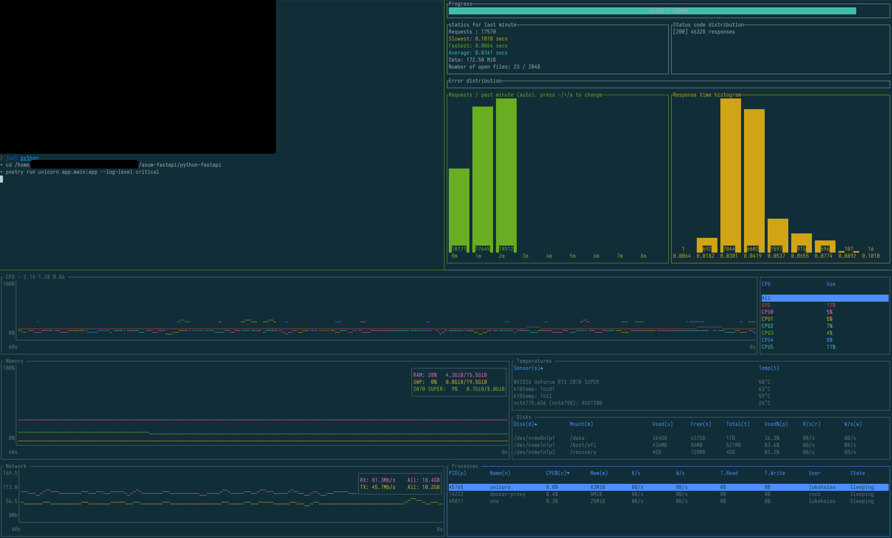

<h1 align="center">
    📊<br>
    FastAPI vs Axum Benchmark with Postgres
</h1>
<div align="center">
    <strong>A simple comparison of Python/FastAPI/SQLAlchemy vs Rust/Axum/sqlx.</strong>
</div>
<br>
<br>

This repo contains two implementations of a _very_ simple web server.

## What the servers do

In both cases, the server fetches users from the `users` table with the following query and returns the results.

```
SELECT * FROM "users" ORDER BY user_id LIMIT 100
```

Postgres database is seeded with 2000 users using the script in `scripts/init_db.sh`.
It is run with docker, and configured to support up to 1000 connections (though both servers only use connection pools of size 5).

[SQLAlchemy](https://docs.sqlalchemy.org/en/20/core/pooling.html)

> This is why it’s perfectly fine for create_engine() to default to using a QueuePool of size five without regard to whether or not the application really needs five connections queued up - the pool would only grow to that size if the application actually used five connections concurrently, in which case the usage of a small pool is an entirely appropriate default behavior.

In Rust, we set the `max_connections` to 5 to match.

## The FastAPI server

The FastAPI server is modeled almost directly from the [FastAPI tutorial on SQL databases](https://fastapi.tiangolo.com/tutorial/sql-databases/).
When benchmarking, we run it with `uvicorn` and a single worker (the default).
While this may seem somewhat unfair (throughput and latency improve with more workers), this is [FastAPI's recommendation](https://fastapi.tiangolo.com/deployment/server-workers/) when running in docker on k8s, as many people do.

> In particular, when running on Kubernetes you will probably not want to use Gunicorn and instead run a single Uvicorn process per container...

Increasing the number of workers to `N` improves throughput and latency, but also multiplies memory usage by `N`, as each worker runs its own process.
As is typically done with FastAPI, we use SQLAlchemy and Pydantic for structured responses.

## The Axum server

The Axum server is modeled almost directly from the [Axum example for sqlx and postgres](https://github.com/tokio-rs/axum/tree/503d31976f8504bba76d9ff6d3b20738eb0f3385/examples/sqlx-postgres/src).

Although Rust does have ORMs (e.g., [diesel](https://diesel.rs/), [SeaORM](https://www.sea-ql.org/SeaORM/)), the compile-time checking of SQLx means that many applications get by without a full-fledged ORM.
This repository could be modified to use diesel as well, since [Axum provides similar examples](https://github.com/tokio-rs/axum/tree/503d31976f8504bba76d9ff6d3b20738eb0f3385/examples/diesel-async-postgres).
But, that is left as an exercise to the reader.

## Modifying the code

In both cases, the code is extremely basic, and should be easy to tweak and experiment with.

## Example Benchmark Results

On my personal PC with 16 GB of RAM and a Ryzen 7 3700X (8-core, 16-thread), I saw the following.
Server and postgres all running locally.

Comparing the numbers (details below), we find the following improvements.

| Metric                  | FastAPI |   Axum | Improvement (%) |
| :---------------------- | ------: | -----: | --------------: |
| Throughput (rps)        |   `305` | `9740` |          `3093` |
| 50% latency (ms)        |  `30.0` |  `1.0` |            `97` |
| 99% latency (ms)        |  `74.6` |  `1.4` |            `98` |
| Peak Memory Usage (MiB) |    `83` |   `10` |            `88` |

### FastAPI

#### Resources
Peak CPU usage about ~8.5% and 83MiB of memory.

#### Performance
```
oha -n 50000 -c 10 --disable-keepalive http://localhost:8000/
Summary:
  Success rate: 100.00%
  Total:        164.1245 secs
  Slowest:      0.1092 secs
  Fastest:      0.0026 secs
  Average:      0.0328 secs
  Requests/sec: 304.6468

  Total data:   490.90 MiB
  Size/request: 10.05 KiB
  Size/sec:     2.99 MiB

Response time histogram:
  0.003 [1]     |
  0.013 [359]   |
  0.024 [11478] |■■■■■■■■■■■■■■■■
  0.035 [22030] |■■■■■■■■■■■■■■■■■■■■■■■■■■■■■■■■
  0.045 [9187]  |■■■■■■■■■■■■■
  0.056 [3143]  |■■■■
  0.067 [2315]  |■■■
  0.077 [1142]  |■
  0.088 [292]   |
  0.099 [43]    |
  0.109 [10]    |

Response time distribution:
  10% in 0.0198 secs
  25% in 0.0242 secs
  50% in 0.0300 secs
  75% in 0.0373 secs
  90% in 0.0513 secs
  95% in 0.0615 secs
  99% in 0.0746 secs

Details (average, fastest, slowest):
  DNS+dialup:   0.0006 secs, 0.0003 secs, 0.0009 secs
  DNS-lookup:   0.0004 secs, 0.0001 secs, 0.0007 secs

Status code distribution:
  [200] 50000 responses
```

### Axum

#### Resources
Peak CPU usage about ~21% and 10MiB of memory.

#### Performance
```
oha -n 50000 -c 10 --disable-keepalive http://localhost:8000/
Summary:
  Success rate: 100.00%
  Total:        5.1335 secs
  Slowest:      0.0023 secs
  Fastest:      0.0005 secs
  Average:      0.0010 secs
  Requests/sec: 9739.9668

  Total data:   490.90 MiB
  Size/request: 10.05 KiB
  Size/sec:     95.63 MiB

Response time histogram:
  0.001 [1]     |
  0.001 [22]    |
  0.001 [3528]  |■■■
  0.001 [29451] |■■■■■■■■■■■■■■■■■■■■■■■■■■■■■■■■
  0.001 [13913] |■■■■■■■■■■■■■■■
  0.001 [2633]  |■■
  0.002 [386]   |
  0.002 [49]    |
  0.002 [12]    |
  0.002 [3]     |
  0.002 [2]     |

Response time distribution:
  10% in 0.0009 secs
  25% in 0.0009 secs
  50% in 0.0010 secs
  75% in 0.0011 secs
  90% in 0.0012 secs
  95% in 0.0013 secs
  99% in 0.0014 secs

Details (average, fastest, slowest):
  DNS+dialup:   0.0000 secs, 0.0000 secs, 0.0009 secs
  DNS-lookup:   0.0000 secs, 0.0000 secs, 0.0006 secs

Status code distribution:
  [200] 50000 responses
```

### Flamegraphs

For the curious, there are [flamegraphs](https://www.brendangregg.com/flamegraphs.html) provided from my machine in the directories of the servers.
For rust, it was collected by running the benchmark and using [cargo-flamegraph](https://github.com/flamegraph-rs/flamegraph), while for python, it was collected using [py-spy](https://github.com/benfred/py-spy).

## What about coordinated omission?

`oha`, the load generator I'm using, does support compensating for [coordinated omission](https://redhatperf.github.io/post/coordinated-omission/).
But, if I do so, it _really_ makes FastAPI look bad.
So bad, that I'd highly suspect I'm doing something wrong, but haven't dug into it yet.

Here's what it looks like with `-q 10000` and `--latency-correction`:

| Metric           |  FastAPI |   Axum | Improvement (%) |
| :--------------- | -------: | -----: | --------------: |
| Throughput (rps) |    `317` | `9920` |          `3029` |
| 50% latency (ms) |  `75000` | `16.2` |         `99.97` |
| 99% latency (ms) | `151000` | `40.4` |         `99.97` |

I think you'll agree that this looks crazy, and suggests there is something I should tweak about the setup.
If you have ideas, please reach out!

### FastAPI

```
❯ oha -n 50000 -c 10 --disable-keepalive --latency-correction -q 10000 http://localhost:8000/
Summary:
  Success rate: 100.00%
  Total:        157.5955 secs
  Slowest:      152.5937 secs
  Fastest:      0.0147 secs
  Average:      76.0228 secs
  Requests/sec: 317.2680

  Total data:   490.90 MiB
  Size/request: 10.05 KiB
  Size/sec:     3.11 MiB

Response time histogram:
    0.015 [1]    |
   15.273 [4820] |■■■■■■■■■■■■■■■■■■■■■■■■■■■■
   30.531 [4859] |■■■■■■■■■■■■■■■■■■■■■■■■■■■■
   45.788 [5246] |■■■■■■■■■■■■■■■■■■■■■■■■■■■■■■■
   61.046 [5362] |■■■■■■■■■■■■■■■■■■■■■■■■■■■■■■■■
   76.304 [5037] |■■■■■■■■■■■■■■■■■■■■■■■■■■■■■■
   91.562 [4983] |■■■■■■■■■■■■■■■■■■■■■■■■■■■■■
  106.820 [5207] |■■■■■■■■■■■■■■■■■■■■■■■■■■■■■■■
  122.078 [4564] |■■■■■■■■■■■■■■■■■■■■■■■■■■■
  137.336 [5088] |■■■■■■■■■■■■■■■■■■■■■■■■■■■■■■
  152.594 [4833] |■■■■■■■■■■■■■■■■■■■■■■■■■■■■

Response time distribution:
  10% in 15.7830 secs
  25% in 38.8800 secs
  50% in 75.2023 secs
  75% in 113.5457 secs
  90% in 136.7149 secs
  95% in 145.2185 secs
  99% in 151.1093 secs

Details (average, fastest, slowest):
  DNS+dialup:   0.0001 secs, 0.0000 secs, 0.0011 secs
  DNS-lookup:   0.0000 secs, 0.0000 secs, 0.0003 secs

Status code distribution:
  [200] 50000 responses
```

### Axum

```
❯ oha -n 50000 -c 10 --disable-keepalive --latency-correction -q 10000 http://localhost:8000/
Summary:
  Success rate: 100.00%
  Total:        5.0403 secs
  Slowest:      0.0415 secs
  Fastest:      0.0020 secs
  Average:      0.0199 secs
  Requests/sec: 9920.0133

  Total data:   490.90 MiB
  Size/request: 10.05 KiB
  Size/sec:     97.40 MiB

Response time histogram:
  0.002 [1]     |
  0.006 [2400]  |■■■■■
  0.010 [1570]  |■■■
  0.014 [9299]  |■■■■■■■■■■■■■■■■■■■■
  0.018 [14379] |■■■■■■■■■■■■■■■■■■■■■■■■■■■■■■■■
  0.022 [4971]  |■■■■■■■■■■■
  0.026 [3931]  |■■■■■■■■
  0.030 [4365]  |■■■■■■■■■
  0.034 [2941]  |■■■■■■
  0.038 [1462]  |■■■
  0.042 [4681]  |■■■■■■■■■■

Response time distribution:
  10% in 0.0105 secs
  25% in 0.0137 secs
  50% in 0.0162 secs
  75% in 0.0265 secs
  90% in 0.0371 secs
  95% in 0.0394 secs
  99% in 0.0404 secs

Details (average, fastest, slowest):
  DNS+dialup:   0.0000 secs, 0.0000 secs, 0.0011 secs
  DNS-lookup:   0.0000 secs, 0.0000 secs, 0.0004 secs

Status code distribution:
  [200] 50000 responses
```

## Running your own

I've provided a [Justfile](https://just.systems/man/en/) to help run things the way I did.
Specifically, you can set up the database with `just initdb` (you'll need docker and postgres installed).
You can run a server with `just python` or `just rust`.
You can run the benchmark with `just oha`.
Note that the number of workers, `C`, can be increased depending on how many threads your CPU has.
If you do too many, `oha` will behave oddly.
I did so using [tmux](https://github.com/tmux/tmux/wiki), but multiple shells will also work.
Monitor the system utilization of `uvicorn` or `rust-axum` however you please; I recommend [btm](https://clementtsang.github.io/bottom/0.9.6/) with the filter `cpu>0 and (uvicorn or rust-axum or docker or oha)` on the Process Widget for a nice view.

### Example setup

<div align="center">



</div>

## Complaints?

Benchmarks are hard.
If you think something is wrong or unfair, please let me know!

## License

This repository is distributed under the terms of the Blue Oak license.
Any contributions are licensed under the same license, and acknowledge via the [Developer Certificate of Origin](https://developercertificate.org/).

See [LICENSE](LICENSE) for details.
